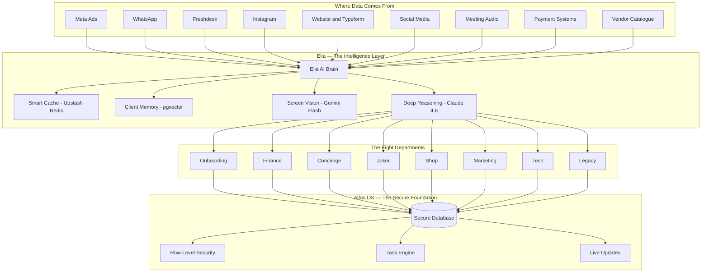
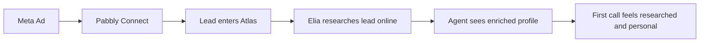
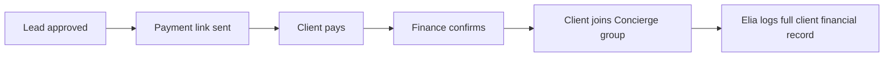
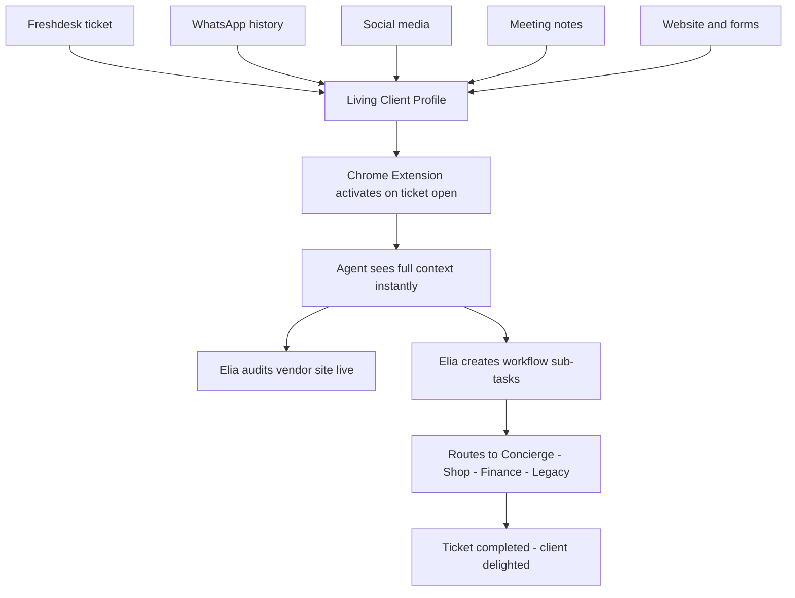
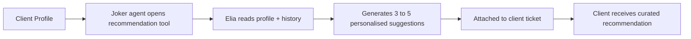
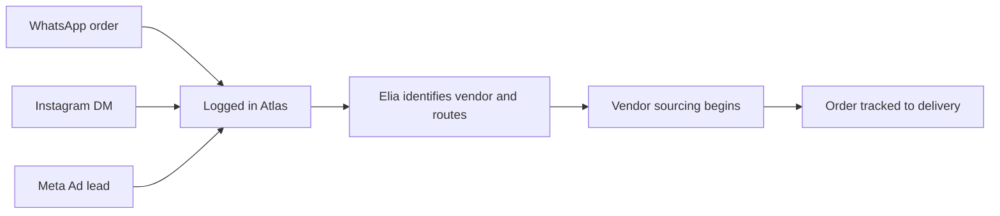
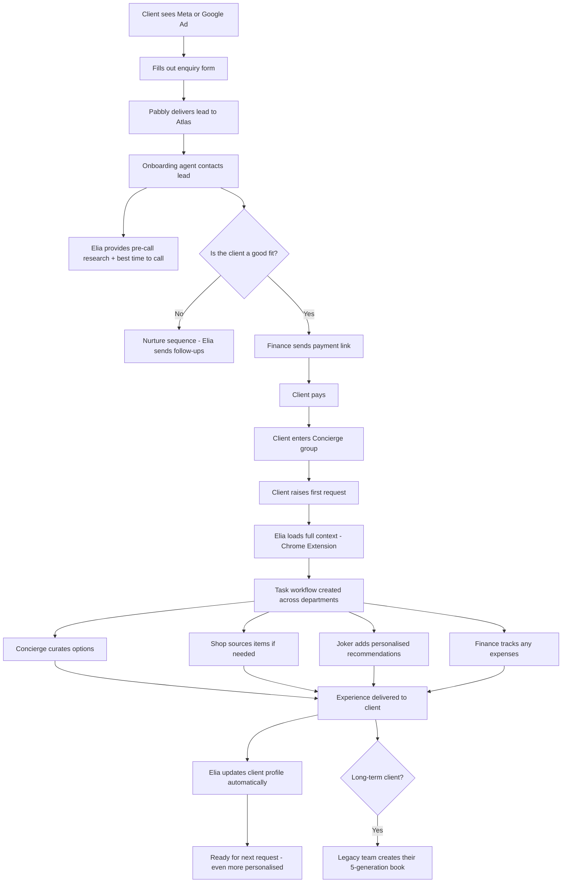

# Across Indulge Group

> Elia is the intelligence layer that sits across every department of Indulge Group. This page shows what she does for each team, where the data comes from, and how it all connects.
> 

---

# How to Read This Page

| Symbol | Meaning |
| --- | --- |
| **Data In** | Where information comes from for each department |
| **Elia Does** | What Elia helps that department accomplish |
| **Atlas Stores** | What gets saved to the secure database |

> Every department connects to the same Elia brain and the same Atlas database. Data flows in from the outside world, Elia processes it, agents act on it, and it all gets stored securely in Atlas — ready for the next interaction.
> 

---

# The Big Picture

---

# The Blurprint

01 — Vision & Problem Statement

02 — Atlas OS Foundation

03 — Core Capabilities

04 — Agent Interfaces

05 — Hybrid Tech Stack & Architecture

06 — Delivery Roadmap

07 — Financial Projections

08 — Security & Compliance

09 — KPIs & Success Metrics

10 — Decision Log

# The Eight Departments

---

## 1. Onboarding

> First contact with the client. Speed and personalisation win the relationship.
> 

**Data In**

| Source | What It Provides |
| --- | --- |
| Meta Ads | New lead details from ad forms |
| Pabbly Connect | Bridge that delivers leads into Atlas instantly |
| Public web data | Professional background, company, social presence |

**Elia Does**

- Researches the lead online before the agent even picks up the phone — so the conversation feels personal from the first second
- Drafts smart follow-up messages tailored to the lead's profile
- Reminds agents when is the best time to call, based on workload and time zone
- Flags leads that have gone cold and suggests re-engagement

---

## 2. Finance

> The money layer. Every rupee in and out — tracked, approved, and reported.
> 

**Data In**

| Source | What It Provides |
| --- | --- |
| Client approval in Atlas | Trigger to send payment link |
| Payment gateway | Confirmation of payment received |
| Department tool bills | Monthly subscription costs to track |
| Concierge requests | Expenses paid on behalf of clients |

**Elia Does**

- Generates and sends payment links when a lead is approved for onboarding
- Tracks whether payment has been received and notifies the right people
- Moves approved paying clients into the Concierge group automatically
- Tracks money spent on behalf of clients and flags when reimbursement is due
- Monitors monthly tool subscriptions across all departments
- Assists with salary and cost reporting

---

## 3. Concierge

> The heart of Indulge. Elia's deepest integration — from first ticket to flawless delivery.
> 

**Data In**

| Source | What It Provides |
| --- | --- |
| Freshdesk | Full ticket history for every client |
| WhatsApp | Real conversation history and tone |
| Typeform and Website | Structured preference data |
| Social Media | Lifestyle signals — travel, dining, hobbies |
| Meeting Audio | Whisper transcription of in-person conversations |

**Elia Does**

- Builds a living client profile that auto-updates with every interaction
- Chrome Extension reads the agent's screen the moment a ticket opens — no searching needed
- Surfaces client constraints, past requests, and vendor history instantly
- Flags vendor conflicts in real time as agents browse supplier sites
- Creates structured sub-tasks for complex requests and routes them to the right team
- Checks ticket quality before submission — ensures nothing is missed

---

## 4. Joker

> Concierge's creative arm. Hyper-personalised recommendations that feel like magic.
> 

**Data In**

| Source | What It Provides |
| --- | --- |
| Client profile (from Concierge) | Preferences, lifestyle, past experiences |
| Past itineraries | What they have done and loved |
| Ticket history | What they ask for repeatedly |

**Elia Does**

- Reads the client's full profile and generates personalised recommendations — travel destinations, restaurants, experiences, hidden gems
- Recommendations are specific, not generic — based on actual client history
- Proposals are attached directly to the ticket workflow so nothing is lost
- Surprise-and-delight ideas for birthdays, anniversaries, and milestones

---

## 5. Shop

> A luxury marketplace. 100+ vendors. Anything sourced. Anywhere.
> 

**Data In**

| Source | What It Provides |
| --- | --- |
| Meta Ads | Shop-specific leads and product enquiries |
| WhatsApp group | Collection broadcasts and inbound orders |
| Instagram DMs | Order requests and product enquiries |
| Vendor catalogue | 100+ supplier product and pricing data |

**Elia Does**

- Routes inbound orders from WhatsApp and Instagram into Atlas automatically
- Suggests which vendor to source from based on product type and availability
- Broadcasts new collections to the WhatsApp group with smart timing
- Tracks order status from source to delivery
- Flags when a client from Concierge has also placed a Shop order — connects the dots

---

## 6. Marketing

> The brand voice. Social, PR, podcast, content — all supercharged.
> 

**Data In**

| Source | What It Provides |
| --- | --- |
| Social media platforms | Engagement data and content performance |
| Campaign metrics | Ad spend and conversion from Meta and Google |
| PR assets | Brand mentions, press hits |
| Podcast content | Episode topics and audience signals |

**Elia Does**

- Maintains a content calendar across all platforms
- Tracks campaign performance and surfaces insights without manual reporting
- Helps write and brief content based on what is performing well
- Coordinates content requests from other departments — Shop launches, Concierge stories, Legacy features
- PR and brand asset library — always up to date

---

## 7. Tech

> The team that keeps everything running. Elia watches herself so Tech can sleep.
> 

**Data In**

| Source | What It Provides |
| --- | --- |
| Atlas system logs | Health of every integration and service |
| Tool usage data | Which tools are being used across departments |
| Error monitoring (Sentry) | Real-time error and performance alerts |

**Elia Does**

- Monitors system health across Atlas, Elia, and all integrations
- Alerts Tech when something breaks — before agents notice
- Tracks all third-party tool subscriptions and usage
- Manages integration health — Pabbly, WhatsApp API, Meta, Freshdesk
- Self-monitors Elia's own AI costs and performance

---

## 8. Legacy

> The most personal product. A 5-generation story, beautifully made.
> 

**Data In**

| Source | What It Provides |
| --- | --- |
| Client interviews | Stories, memories, family history |
| Photo archives | Uploaded family photographs |
| Family records | Documents, timelines, genealogy |

**Elia Does**

- Structures interview notes into a coherent narrative
- Manages the production workflow — from interview to draft to final book
- Organises photo assets and suggests layout.
- Tracks the project timeline and milestones
- Archives the final book and all source materials securely in Atlas

---

# How a Client Moves Through Indulge

From the first ad click to a lifelong luxury relationship.

---

# 

---