# Architecture — The System Map

> This is the single source of truth for how every piece of the Elia system connects. 
Every data flow, every tool interaction, every boundary.
> 

---

# 1. The 3 Planes

Elia is not a standalone app. She is an intelligence layer stitched across three planes:

| Plane | What Lives Here |
| --- | --- |
| **Data Plane** | Supabase (PostgreSQL + pgvector), AWS S3, WhatsApp, Freshdesk |
| **Intelligence Plane** | Gemini Flash (perception), Claude 4.6 (reasoning), Jina (embeddings), Whisper (audio) |
| **Interaction Plane** | Chrome Extension (desktop), Floating Assistant (mobile), Atlas web UI |

Data flows up from the Data Plane, intelligence is applied in the Intelligence Plane, and results surface in the Interaction Plane. Agents always have the final say before any action executes.

---

# 2. Top-Level System Architecture

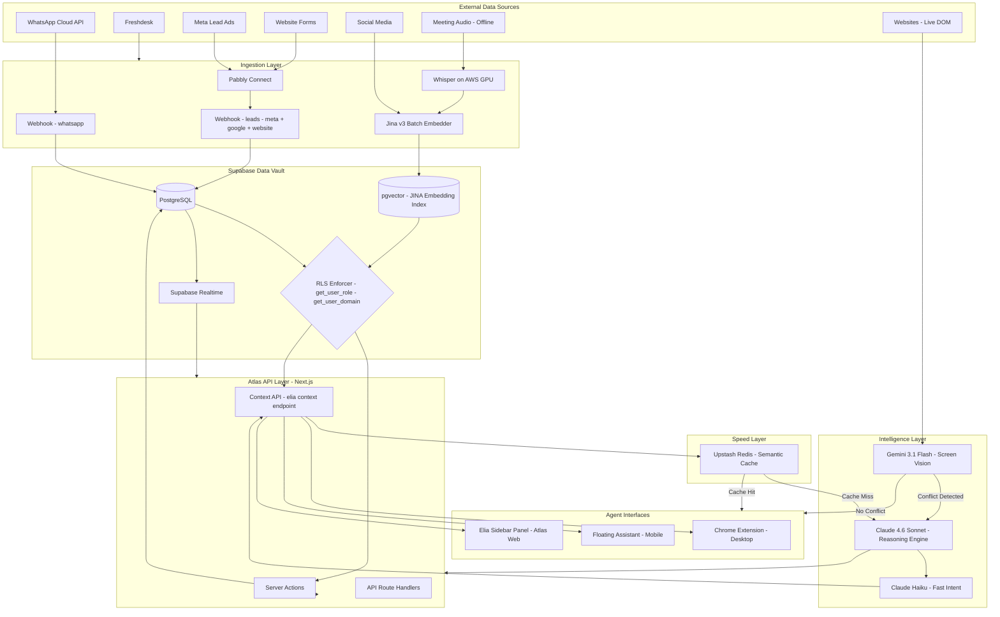

---

# 3. Data Ingestion Flows

## 3A — Lead Ingestion (Meta / Google / Website)

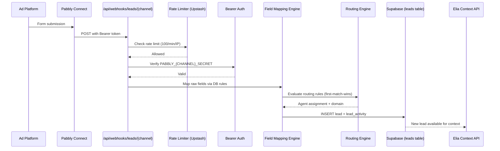

## 3B — WhatsApp Two-Way Sync

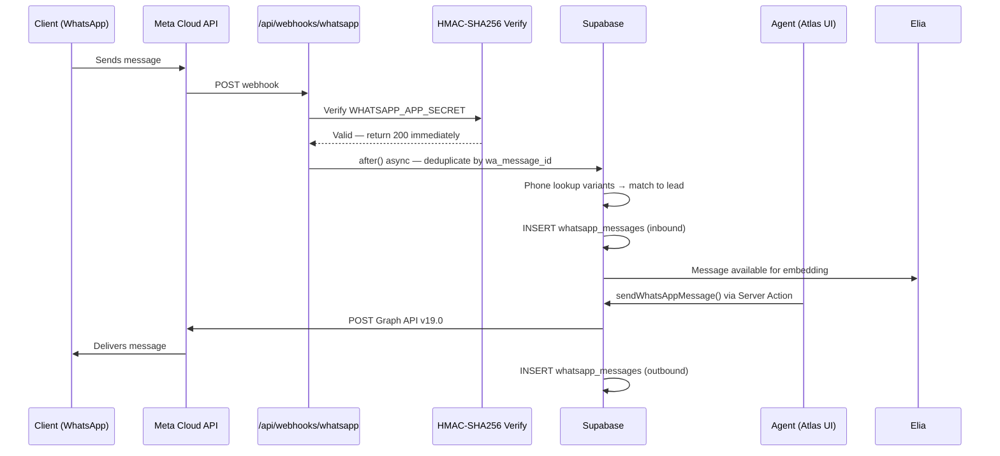

## 3C — Silent Enrichment Pipeline

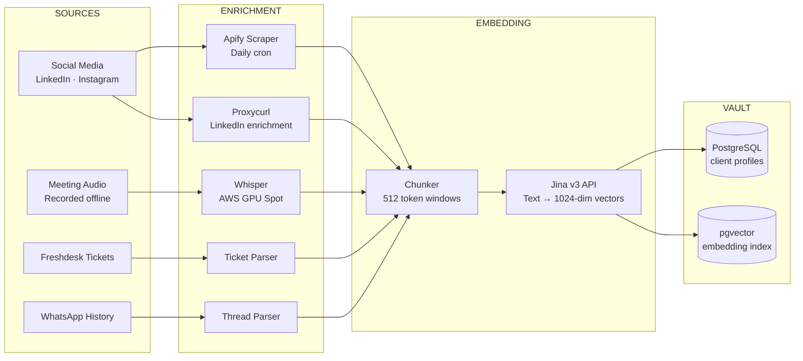

---

# 4. Elia Intelligence Flows

## 4A — Auto-Context: Agent Opens a Lead

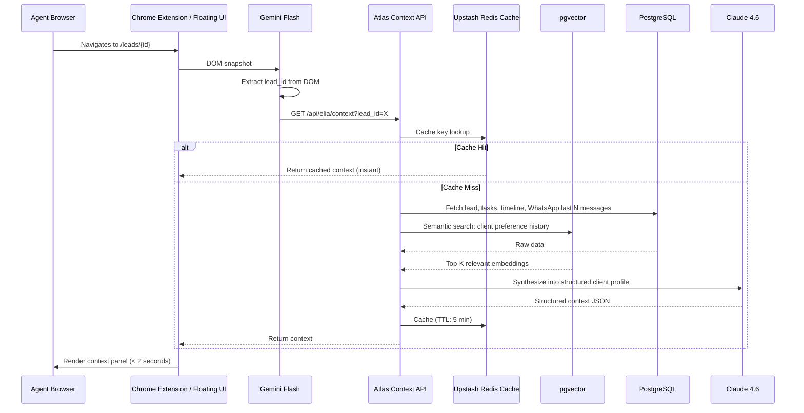

## 4B — Live Vendor Auditing

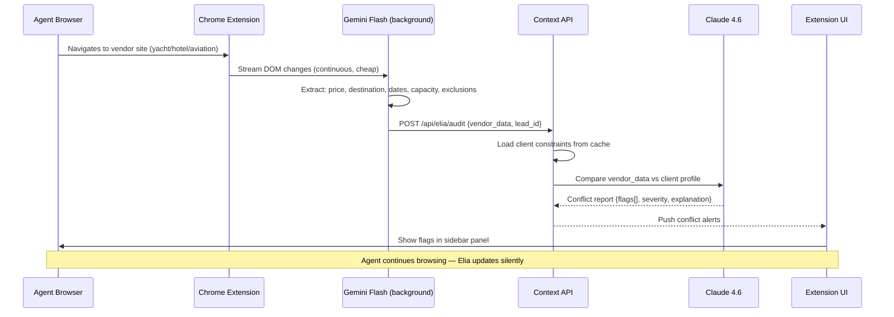

## 4C — Agentic Workflow Orchestration

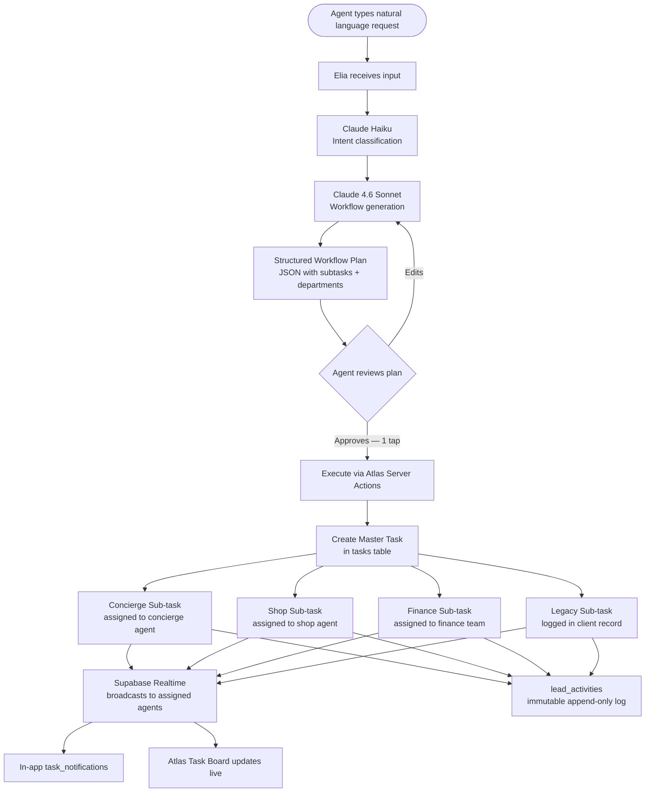

---

# 5. The Security Boundary

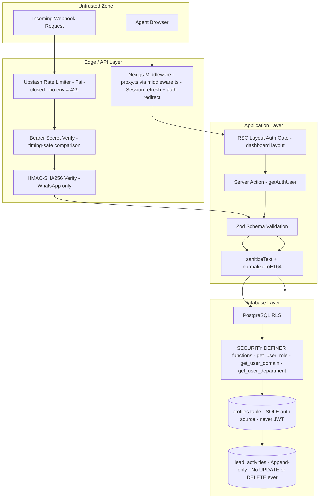

> [!IMPORTANT]
> 

> `get_user_role()`, `get_user_domain()`, and `get_user_department()` read **only from `public.profiles`**. JWT claims are never trusted for authorization. This is a load-bearing invariant — it must never change.
> 

---

# 6. Data Model Relationships

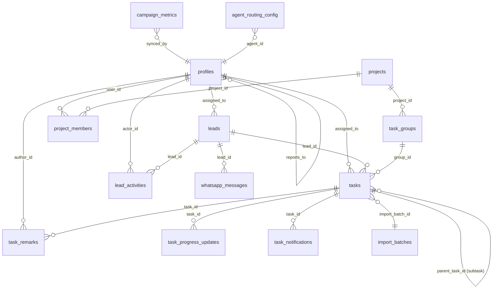

---

# 7. Access Control Model

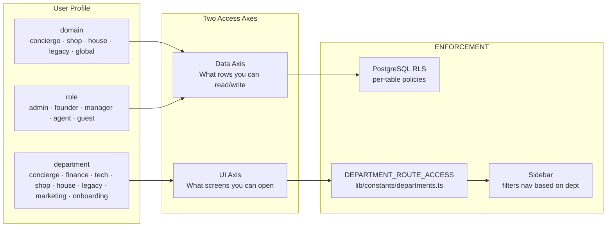

**Special Cases:**

| Domain | Who | Data Scope |
| --- | --- | --- |
| `indulge_global` | Finance, Tech, Marketing | SELECT across ALL domains |
| `indulge_concierge` | Concierge agents | Concierge rows only |
| `indulge_shop` | Shop agents | Shop rows only |
| `indulge_house` | House agents | House rows only |
| `indulge_legacy` | Legacy agents | Legacy rows only |

> [!NOTE]
> 

> `indulge_global` grants cross-domain READ. It does not grant WRITE across domains. `pick_next_agent_for_domain()` normalises `indulge_global` → `indulge_concierge` for lead assignment — Finance/Tech staff are never assigned leads.
> 

---

# 8. Chrome Extension Architecture

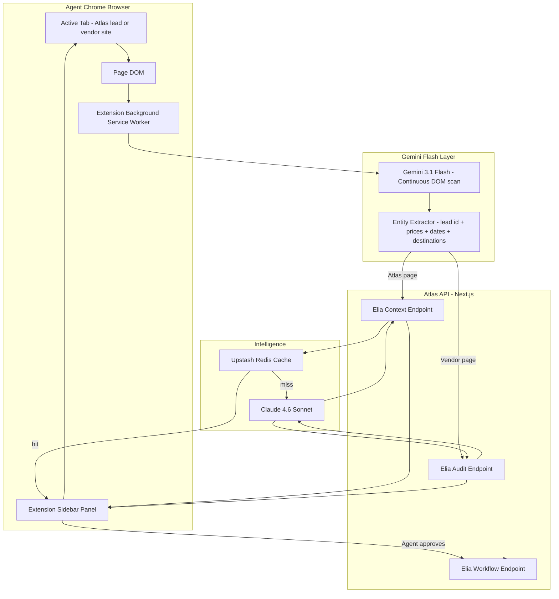

---

# 9. Realtime Architecture

Elia and Atlas use **Supabase Realtime** for live updates — no polling, no WebSockets server to manage.

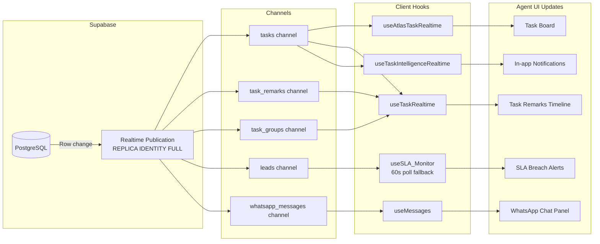

---

# 10. Cost & Request Flow — The Economics

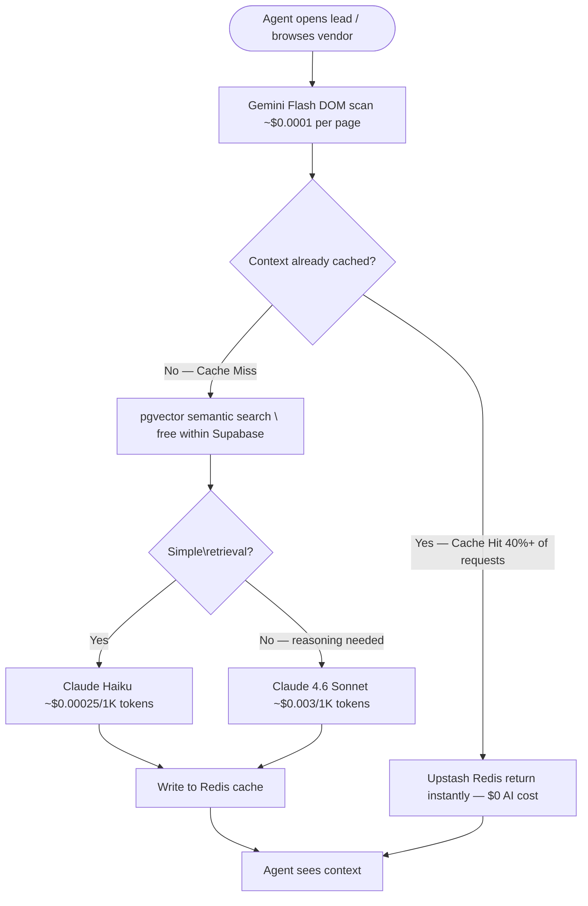

**Cost control summary:**

- Gemini Flash runs always — it is the cheapest possible perception layer
- Redis cache absorbs ~40%+ of Claude calls entirely
- Haiku handles fast intent classification — Sonnet activates only for complex reasoning
- pgvector is free — no external vector DB bill

---

# 11. Deployment Architecture

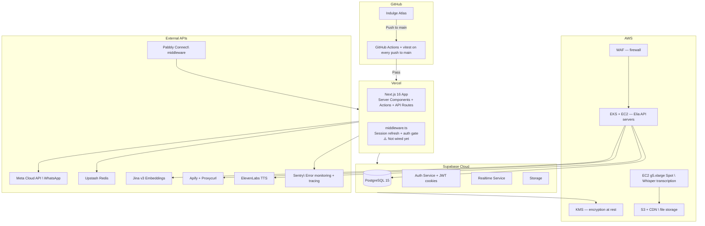

> [!IMPORTANT]
> 

> **Critical gap**: `middleware.ts` does not exist at the Next.js root. `proxy.ts` contains the implementation but is never loaded. Session refresh and edge-level auth gate are non-functional until `middleware.ts` is created with `export { proxy as middleware, config } from "./proxy"`.
> 

---

# 12. Key Architectural Rules

These are non-negotiable. Changing any requires a full architecture review.

| # | Rule |
| --- | --- |
| 1 | `get_user_role()`, `get_user_domain()`, `get_user_department()` read **only from `public.profiles`**. JWT claims never trusted for authorization. |
| 2 | All SECURITY DEFINER functions have `SET search_path = public`. |
| 3 | `lead_activities` and `task_progress_updates` are append-only. No UPDATE or DELETE. Ever. |
| 4 | `components/ui/` is zero-dependency — no imports from `lib/actions/` or feature code. |
| 5 | Server Actions are the **only** entry point from components to DB mutations. |
| 6 | All user-supplied text fields pass through `sanitizeText()` before any DB write. |
| 7 | Phone numbers stored in E.164. `normalizeToE164()` on every phone field before insert. |
| 8 | `pg_advisory_xact_lock` on `pick_next_agent_for_domain()` must never be removed. |
| 9 | Every new table must have RLS enabled. |
| 10 | Elia never sends raw UHNI PII to Claude or Gemini APIs. Data is pseudonymized before leaving the vault. |
| 11 | All Elia agentic actions require explicit agent approval before execution. Elia proposes — agents decide. |