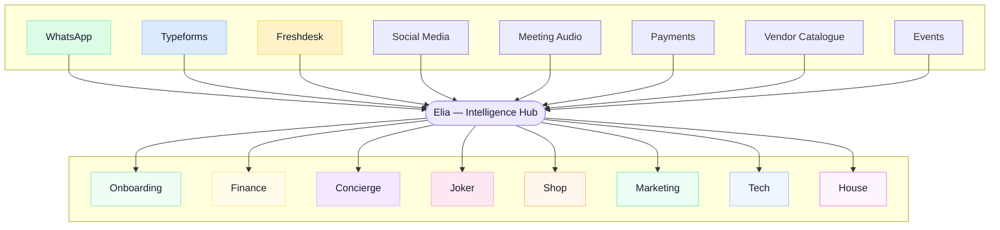
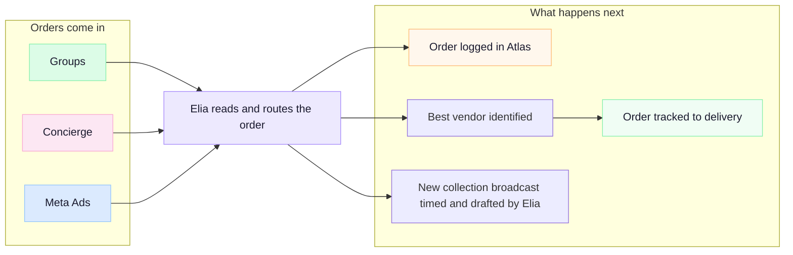
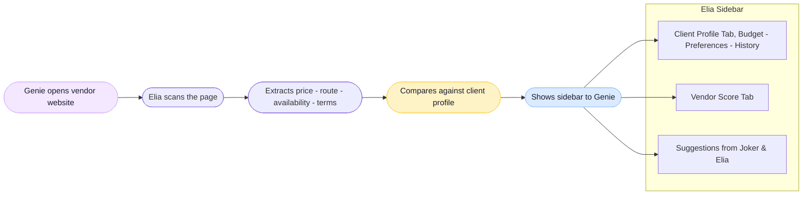
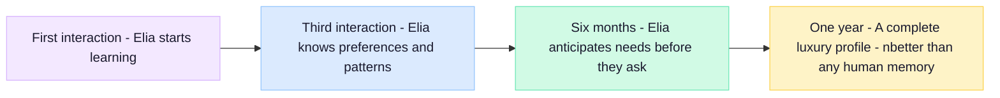

# Concierge

> Elia sits at the centre of everything. Every department connects through her. Every client interaction flows through her. This is the full picture.
> 

---

# Elia — The Central Hub

---

# The Concierge Ticket Journey

This is Elia's deepest integration. From the moment a client sends a WhatsApp message to the moment they receive a reply — Elia handles the intelligence layer at every step.

```mermaid
flowchart TD
    MSG([Client sends a whatsApp message]) 
    
    MSG --> BOT[Elia chatbot replies instantly]
    BOT --> CAPTURE[Elia reads and classifies the request]
    CAPTURE --> TICKET[Freshdesk ticket auto-created, pre-filled and categorised]

    subgraph TICKET_FIELDS [" What Elia fills automatically "]
        TF1[Request type - classified]
        TF2[Client name and profile - matched]
        TF3[Request details - extracted]
        TF4[Priority - based on client messages]
        TF5[Recommended Genie - by workload]
    end

    TICKET --> TICKET_FIELDS
    TICKET_FIELDS --> BISHOP[Bishop gets an alert]
    BISHOP --> APPROVE[Bishop reviews and approves]
    APPROVE --> GENIE[Ticket assigned to Genie]

    GENIE --> EXT[Genie activates Elia Chrome Extension]

    subgraph SIDEBAR [" Elia Sidebar "]
        TAB1[Client Profiles]
        TAB2[Vendor Score]
        TAB3[Suggestions]
    end

    EXT --> SIDEBAR
    SIDEBAR --> DECIDE[Genie makes a confident decision]
    DECIDE --> DRAFT[Elia drafts the WhatsApp update for Bishop to review]
    DRAFT --> SEND[Bishop reads and taps sends]
    SEND --> CLIENT([Client receives a polished update])
    CLIENT --> STORE[Elia stores every interaction]

    style MSG fill:#f3e8ff,stroke:#d8b4fe,color:#1a1a2e
    style BOT fill:#dbeafe,stroke:#93c5fd,color:#1a1a2e
    style TICKET fill:#dbeafe,stroke:#93c5fd,color:#1a1a2e
    style TICKET_FIELDS fill:#f0fdf4,stroke:#86efac
    style BISHOP fill:#fef3c7,stroke:#fcd34d,color:#1a1a2e
    style APPROVE fill:#fef3c7,stroke:#fcd34d,color:#1a1a2e
    style GENIE fill:#f3e8ff,stroke:#d8b4fe,color:#1a1a2e
    style EXT fill:#ede9fe,stroke:#a78bfa,color:#1a1a2e
    style SIDEBAR fill:#f0fdf4,stroke:#86efac
    style TAB2 fill:#d1fae5,stroke:#6ee7b7,color:#1a1a2e
    style DECIDE fill:#fce7f3,stroke:#f9a8d4,color:#1a1a2e
    style SEND fill:#dbeafe,stroke:#93c5fd,color:#1a1a2e
    style CLIENT fill:#f0fdf4,stroke:#86efac,color:#1a1a2e
    style STORE fill:#fef3c7,stroke:#fcd34d,color:#1a1a2e
```

> They go from information gatherer to decision maker.
> 
> 
>  Elia handles the noise. **The Genie handles the craft**.
> 

---

# The Chrome Extension Sidebar

The moment a Genie visits any vendor website, this appears on the right side of their screen.

> 👤 **Tab 1 — Client Profile**
> 

> Budget range. Preferred operators. Cabin class. Dietary needs. Past complaints. Known travel patterns. Everything the Genie needs to make the right call.
> 

> ⭐ **Tab 2 — Vendor Score**
> 

> A match score for this vendor against this specific client. With a reason.
> 

> *"8.5 out of 10 — matches budget and Gulf route preference. Note: client chose a different operator last time for overnight flights."*
> 

> 📋 **Tab 3 — Suggested Vendors**
> 

> If this vendor doesn't feel right, Elia shows the top 3 alternatives. Pre-ranked. Pre-matched. Ready to open.
> 

## Prototype Snapshots

[Gallery](Concierge/Gallery%20357128b7f351807daedaff735ad7fe1b.csv)

---

# Finance — How Elia Helps

```mermaid
flowchart LR
    LEAD([OTP Requested by genies]) --> LINK[Elia notifies finance]
    LINK --> PAY[Finance logs the amount and details]
    PAY --> CONFIRM[OTP Shared in a secured channel]
    CONFIRM --> JOIN[Genie updates on elia]

    subgraph ONGOING [" Elia subtasks "]
        EXP[Upate the ticket history]
        TOOLS[UPdate the finance ledger on zoho books]
        SAL[Creates a comprehendive reports of dues]
        INV[Auto Invoice generation]
    end

    JOIN --> ONGOING

    style LEAD fill:#fefce8,stroke:#fde68a,color:#1a1a2e
    style LINK fill:#dbeafe,stroke:#93c5fd,color:#1a1a2e
    style CONFIRM fill:#d1fae5,stroke:#6ee7b7,color:#1a1a2e
    style JOIN fill:#f0fdf4,stroke:#86efac,color:#1a1a2e
    style ONGOING fill:#fefce8,stroke:#fde68a
```

---

# Shop — How Elia Helps

---

# Step by Step — The New Ticket Journey

## Step 1 — Client Messages

> 💬 **Client sends a WhatsApp message**
> 

> *"I need a private jet to Dubai this Friday for 4 people."*
> 

In the old workflow, this sits in Bishop's inbox waiting to be read.

With Elia, it is read instantly.

---

## Step 2 — Elia Chatbot Replies

> 🤖 **Elia's AI chatbot responds within seconds**
> 

The client gets an instant acknowledgement. Professional. On-brand. No delay.

In the background, Elia:

- Reads the full message and classifies the request type
- Identifies the client from their phone number
- Pulls their full profile — preferences, past bookings, budget signals

---

## Step 3 — Ticket Auto-Created in Freshdesk

> 🎫 **A ticket appears in Freshdesk — already filled**
> 

| Field | Before Elia | With Elia |
| --- | --- | --- |
| Request type | Bishop fills manually | Auto-classified |
| Client name | Bishop fills manually | Auto-matched from profile |
| Request details | Copy-pasted from WhatsApp | Extracted and structured |
| Priority | Bishop decides | Elia suggests based on client tier |
| Suggested Genies | Bishop thinks | Elia recommends based on workload |

---

## Step 4 — Bishop Gets an Alert

> 👁️ **Bishop sees a clean, ready-to-approve ticket**
> 

Not a raw WhatsApp message. A properly structured, categorised, pre-filled ticket.

Bishop's job here: **read and approve**.

---

## Step 5 — Genie Opens the Ticket

> ✨ **Genie sees the full client world on screen**
> 

The moment Genie opens the ticket, Elia loads:

- Client Profile and relationship history
- Past requests and preferences
- Known likes and dislikes
- Active budget and constraints
- Any notes from previous Genies

No searching. No asking Bishop. No reading through old tickets.

---

## Step 6 — Genie Browses Vendors — Elia Watches

> 🌐 **Genie activates the Elia Chrome Extension**
> 

Elia's browser extension sits in the corner. The moment Genie visits a private aviation vendor site:

**The Sidebar has three tabs:**

> 👤 **Tab 1 — Client Profile**
> 

> Everything Elia knows about this client. Budget signals. Preferred airlines. Cabin class. Dietary needs for the flight. Past complaints.
> 

> ⭐ **Tab 2 — Vendor Score**
> 

> A match score for this specific vendor against this specific client. With a reason. *"8.5/10 —matches budget and route preference. Note: client previously chose a different operator for Gulf routes."*
> 

> 📋 **Tab 3 — Suggested Vendors**
> 

> Elia's top 3 alternative vendors if this one doesn't feel right. Pre-ranked by match score.
> 

---

## Step 7 — Genie Decides and Confirms

> ✅ **Genie makes the call**
> 

Genie now decides with full information. Confident. Fast.

The booking is logged against the ticket in Freshdesk.

---

## Step 8 — WhatsApp Update Handled by Elia

> 📲 **Client gets live updates — without Bishop writing a word**
> 

Elia detects the ticket progress. Auto updates client on whatsapp:

*"Your private jet to Dubai this Friday is confirmed. Departure: 10:00 AM from Terminal 2. 4 seats. Tail number and crew details to follow shortly."*

Bishop reviews and hits send. One tap.

Elia then:

- Stores this interaction in the client's profile
- Updates preference data based on what was chosen
- Flags any patterns for future requests

---

# What Changed — At a Glance

| Step | Before Elia | With Elia | Time Saved |
| --- | --- | --- | --- |
| Client acknowledged | Bishop replies when free | Instant AI response | Minutes → Seconds |
| Ticket created | Bishop fills manually | Auto-created and structured | 5 min → 0 min |
| Bishop review | Full context gathering | One-tap approve | 10 min → 30 sec |
| Genie gets context | Reads old tickets manually | Full profile on screen | 15 min → 0 min |
| Vendor research | Manual browsing, no scoring | Live scoring vs client profile | 30 min → 5 min |
| Client update | Bishop writes from scratch | Elia drafts, Bishop approves | 5 min → 30 sec |
| Record keeping | Manual notes | Auto-stored in profile | 5 min → 0 min |

> Elia handles the noise. The Genie handles the craft.
> 

# The Compounding Effect

> Every ticket makes the next one better.
> 

> 
> 
> 
> After this jet booking is complete, Elia knows:
> 
> - This client books private aviation on short notice
> - They prefer Gulf routes on specific operators
> - Friday departures are common — maybe suggest proactive slots next time
> - 4 pax is their usual group size
> 
> The next request arrives. Elia already has a head start.
> 

> **Day 1 is good. Year 1 is extraordinary.**
>